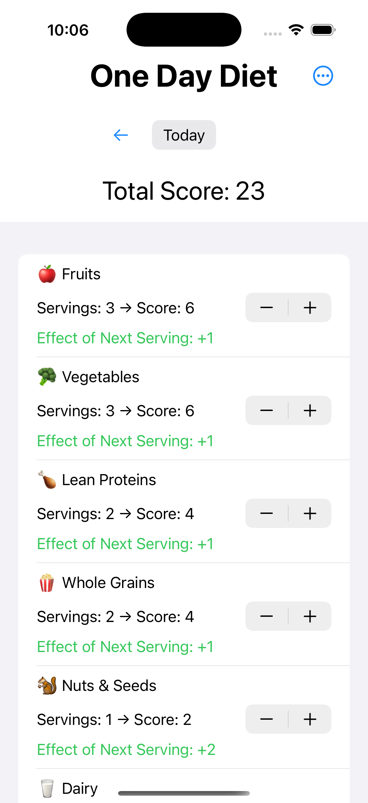
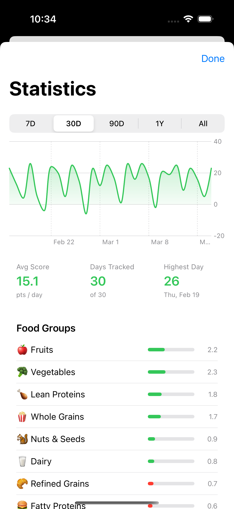

# One Day Diet

A simple iOS app for tracking daily food intake using the diet quality scoring system from [Racing Weight](https://www.mattfitzgerald.org/racing-weight) by Matt Fitzgerald. Log servings across 10 food groups and watch your score reflect how well you ate that day.

[Download on the App Store](https://apps.apple.com/us/app/one-day-diet/id6475656051) or [read more on my site](https://www.iammike.org/?page_id=4559).

<div align="center">
  
  &nbsp;&nbsp;&nbsp;
  
</div>

## How it works

Each of the 10 food groups has a scoring array - healthy groups add points, unhealthy ones subtract:

| Group | Direction |
|---|---|
| Fruits, Vegetables | +++ |
| Lean Proteins, Whole Grains, Nuts & Seeds | ++ |
| Dairy | + |
| Refined Grains, Fatty Proteins | -- |
| Sweets, Fried Foods | --- |

Your daily total score gives you an honest picture of how you ate. A perfect day tops out around 40+.

## Features

- Track servings for all 10 food groups with real-time score updates
- Browse past days with swipe gestures or the date picker
- View score history and food group trends in the Stats view
- Optional macro tracking (Water, Carbs, Protein, Fat)
- Shake to undo a serving change
- Light, Dark, or System appearance
- Works on iPhone and Mac (via Catalyst)

## Tech

SwiftUI, MVVM. All data stored in UserDefaults - no network, no accounts, no backend.

## Building

Open `One Day Diet.xcodeproj` in Xcode and hit `Cmd+R`. No dependencies to install.

```bash
xcodebuild -project "One Day Diet.xcodeproj" \
  -scheme "One Day Diet" \
  -destination "generic/platform=iOS Simulator" \
  build
```
